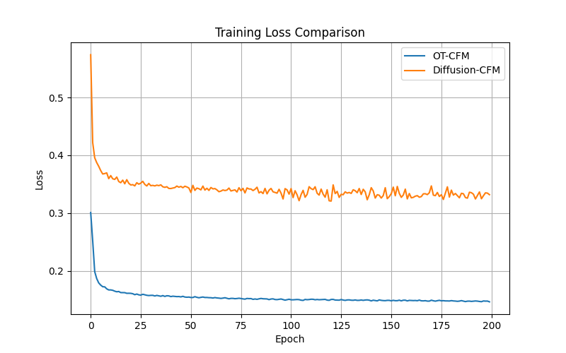
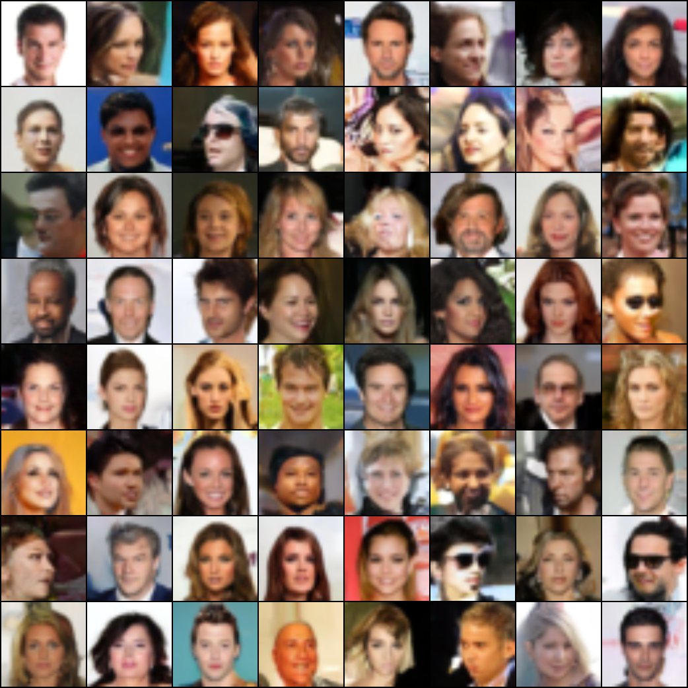
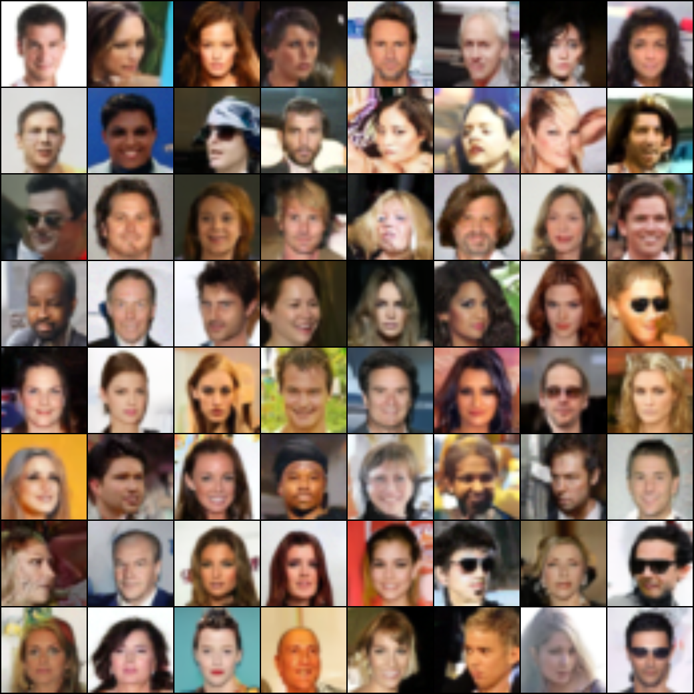

# Flow Matching for Generative Modeling

Implementation of **Conditional Flow Matching (CFM)** for continuous-time image generation on the **CelebA** dataset using Neural ODEs and attention-based U-Net architectures. This project reproduces core concepts from *Flow Matching for Generative Modeling* (ICML 2022) by learning continuous velocity fields that transform random noise into realistic face images through adaptive ODE integration.

The model was implemented entirely in **PyTorch** using:
- Residual U-Net blocks
- Self-attention layers
- Sinusoidal timestep embeddings
- Adaptive Neural ODE sampling (`dopri5`)
- EMA stabilization
- Cosine annealing learning rate scheduling
- FID and NFE evaluation metrics

---

# Model Architecture

The project uses a custom U-Net backbone configured with:
- Channel size: `128`
- Time embedding dimension: `512`
- Residual convolutional blocks
- Self-attention modules
- Hierarchical downsampling and upsampling

The model predicts continuous velocity fields conditioned on:
- image state
- continuous timestep

to learn transport trajectories from noise distributions to real image distributions.

---

# Training Configuration

| Parameter | Value |
|---|---|
| Dataset | CelebA |
| Resolution | 32×32 |
| Batch Size | 128 |
| Optimizer | AdamW |
| Learning Rate | 2e-4 |
| Epochs | 200 |
| LR Scheduler | CosineAnnealingLR |
| EMA | 0.999 |
| ODE Solver | dopri5 |
| Solver Tolerance | rtol=1e-5, atol=1e-5 |
| Random Seed | 42 |

---

# Results & Comparison

## Baseline Results from Original Paper

| Method | Dataset | FID ↓ | NFE ↓ |
|---|---|---|---|
| Diffusion CFM | ImageNet32 | 6.37 | 193 |
| OT-CFM | ImageNet32 | 5.02 | 122 |

## Our CelebA Results

| Method | Dataset | FID ↓ | NFE ↓ |
|---|---|---|---|
| Diffusion CFM | CelebA | 2.975 | 206 |
| OT-CFM | CelebA | 2.546 | 164 |

### Observations
- The original paper showed that OT-CFM achieves lower FID and reduced Neural Function Evaluations (NFE) compared to diffusion-based flow matching.
- Our CelebA experiments followed the same trend, where OT-CFM achieved better generation quality and more efficient sampling than Diffusion-CFM.
- Adaptive Neural ODE integration produced smooth transport trajectories from random noise to realistic face generations.
- EMA stabilization improved training consistency and reduced noisy updates during optimization.
- Despite reduced compute resources and smaller-scale training compared to the original paper, the relative performance behavior between Diffusion-CFM and OT-CFM remained consistent.

---

# Training Loss Comparison

OT-CFM demonstrated faster and more stable convergence compared to diffusion-based flow matching.



---

# Generated CelebA Samples

### OT-CFM Samples


### Diffusion-CFM Samples


---

# Technical Stack

`PyTorch` `torchdiffeq` `TorchMetrics` `NumPy` `Matplotlib` `CelebA`

---

# Run

```bash
python train_ot_cfm.py
python train_diffusion_cfm.py
python plot.py
```

---

# Reference

Lipman et al., *Flow Matching for Generative Modeling*, ICML 2022  
https://arxiv.org/abs/2210.02747
